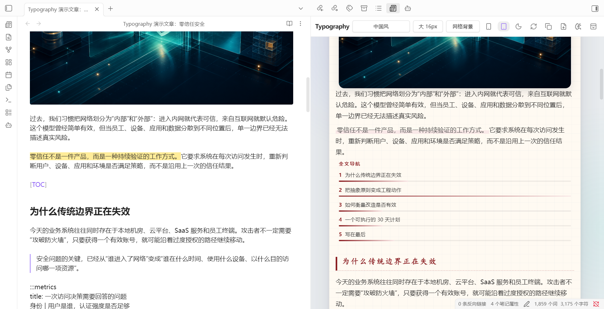
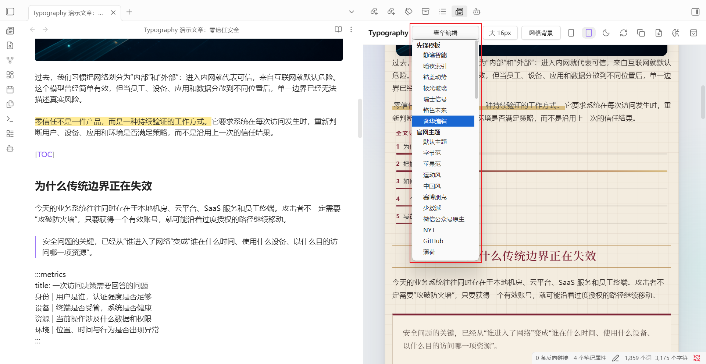
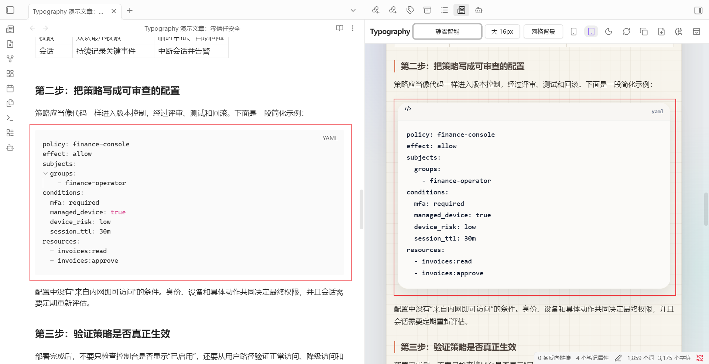
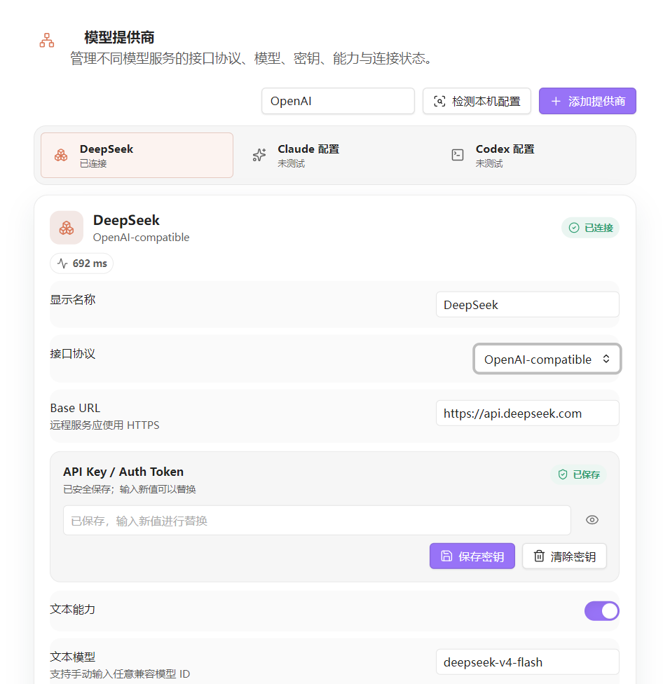
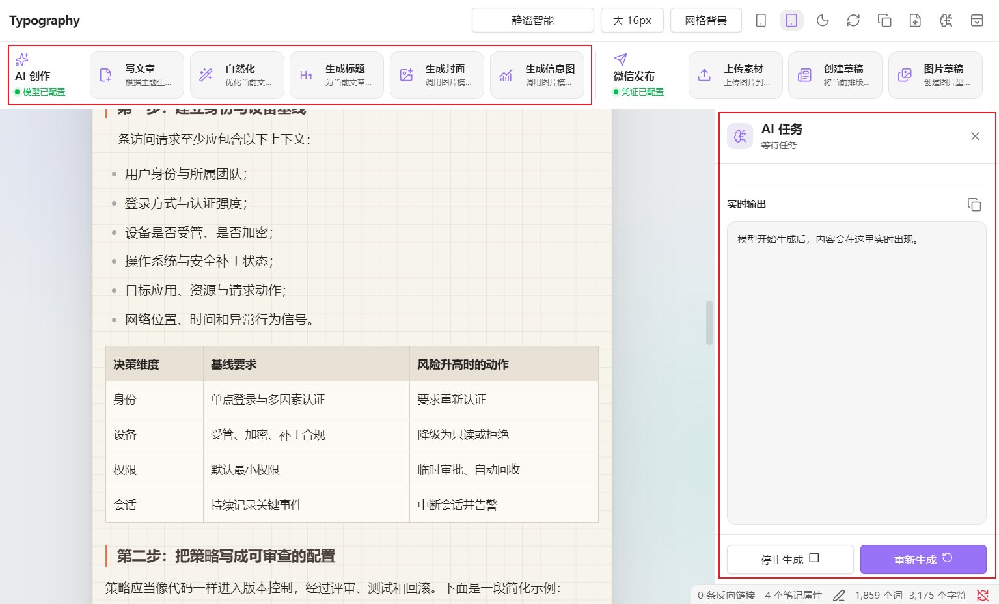
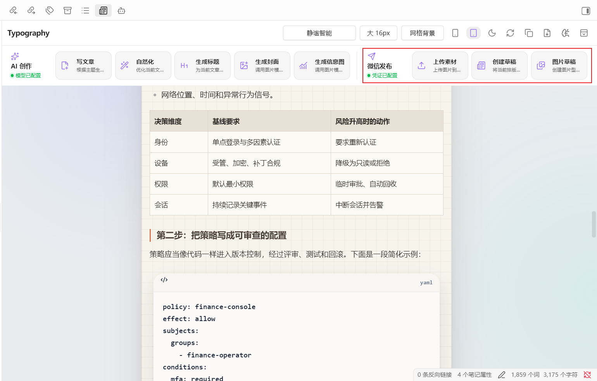

# Typography

<p align="center"><strong>Obsidian 微信公众号排版、AI 创作与草稿发布插件</strong></p>

<p align="center">
  
  
  
  
</p>

Typography 在 Obsidian 内完成 Markdown 转微信公众号富文本、实时预览、主题排版、AI 创作、图片处理和微信草稿发布。本地排版不需要 API Key，不依赖在线转换服务。

## 功能展示

<table>
  <thead>
    <tr>
      <th width="30%">功能</th>
      <th width="70%">界面截图</th>
    </tr>
  </thead>
  <tbody>
    <tr>
      <td><strong>排版工作台</strong><br><br>在同一界面完成主题、字号和背景切换，支持手机与平板预览、富文本复制、HTML 导出和源文件实时刷新。</td>
      <td></td>
    </tr>
    <tr>
      <td><strong>主题与高级布局</strong><br><br>内置官网主题、可能吧主题、AI 主题和先锋模板；支持标题、引用、表格、图片、提示卡、时间线、指标等布局。</td>
      <td></td>
    </tr>
    <tr>
      <td><strong>代码块与发布兼容</strong><br><br>提供语法高亮和 Liquid Glass 预览效果；发布时自动使用微信可保留的渐变、圆角、阴影和等宽字体。</td>
      <td></td>
    </tr>
    <tr>
      <td><strong>模型控制中心</strong><br><br>支持 OpenAI-compatible、Anthropic、OpenRouter、DeepSeek、Codex Runtime 和自定义网关，文本与图片任务可独立路由。</td>
      <td></td>
    </tr>
    <tr>
      <td><strong>AI 任务面板</strong><br><br>提供文章写作、自然化、标题生成、封面和信息图生成，并显示执行步骤、模型、耗时与实时输出。</td>
      <td></td>
    </tr>
    <tr>
      <td><strong>微信公众号草稿</strong><br><br>上传封面和正文图片，替换本地图片地址并创建微信公众号草稿，完成后返回面向普通用户的结果提示。</td>
      <td></td>
    </tr>
  </tbody>
</table>


## 核心能力

| 分类 | 能力 |
|---|---|
| 本地排版 | Markdown 转微信富文本、实时预览、选区排版、复制、HTML 导出 |
| 内容组件 | 标题、引用、列表、表格、任务项、脚注、图片、代码块和高级模块 |
| 图片处理 | Wiki 图片、相对路径、中文文件名、内嵌复制、微信图片上传 |
| AI 创作 | 写文章、自然化、标题生成、封面生成、信息图生成 |
| 模型连接 | 多提供商、多连接、模型发现、连接测试、文本和图片独立路由 |
| 微信发布 | 获取令牌、上传素材、创建普通图文草稿和图片型草稿 |
| 凭证安全 | 模型密钥保存在 Obsidian SecretStorage；`data.json` 不提交到仓库 |

## 安装

下载 Release 中的以下文件：

```text
main.js
manifest.json
styles.css
```

复制到：

```text
<Obsidian 仓库>/.obsidian/plugins/typography/
```

重启 Obsidian，在“设置 - 第三方插件”中启用 Typography。

## 使用

1. 打开 Markdown 文件。
2. 点击左侧 Typography 图标，或在命令面板运行“本地排版并预览”。
3. 选择主题、字号和背景。
4. 点击复制，将富文本粘贴到微信公众号编辑器。

有编辑器选区时只排版选区；没有选区时排版全文。

## AI 与微信配置

- 本地排版、检查、预览和导出不需要模型配置。
- AI 功能需要配置对应模型提供商；API Key 保存在 SecretStorage。
- 微信草稿需要公众号 `AppID`、`AppSecret`，并将出口 IP 加入公众号白名单。
- 文章可通过 frontmatter 指定标题、作者、摘要和封面：

```yaml
---
title: 文章标题
author: 作者名称
digest: 文章摘要
cover: assets/cover.png
---
```

## 开发

需要 Node.js 18 或更高版本。

```bash
npm ci
npm run dev
npm run build
```

生产构建输出为 `main.js`。用户安装包只需要 `main.js`、`manifest.json` 和 `styles.css`。

## License

[MIT](LICENSE) © 2026 Alucard
